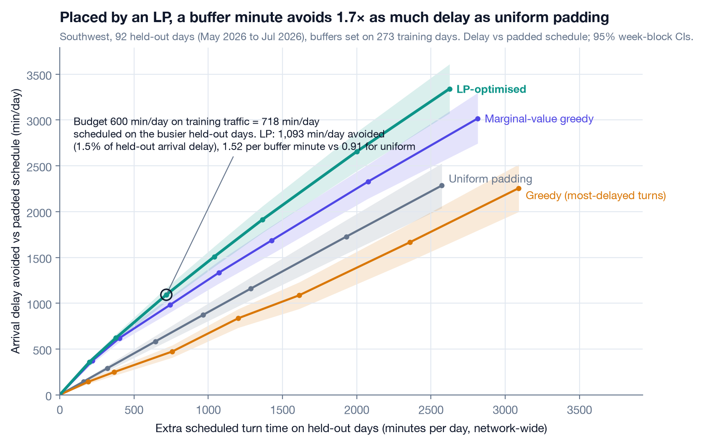
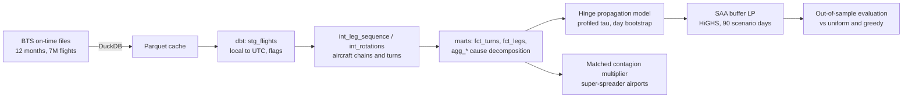
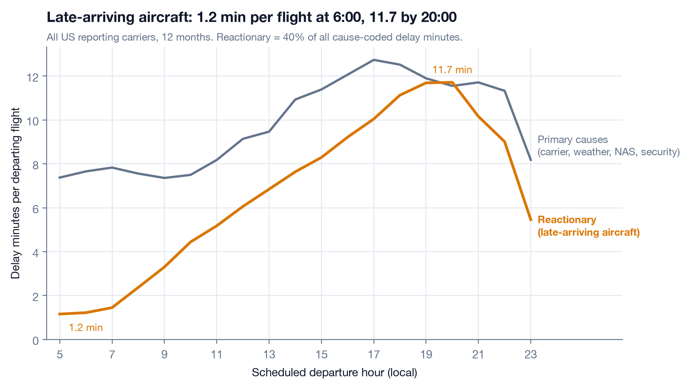
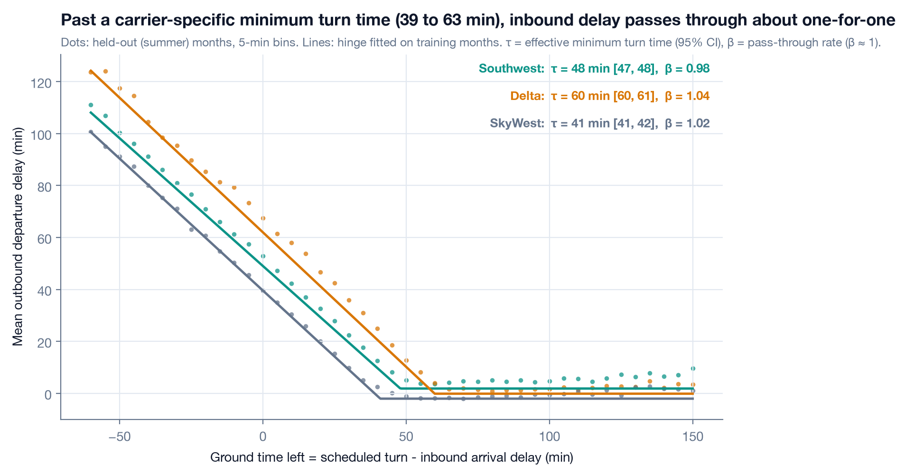
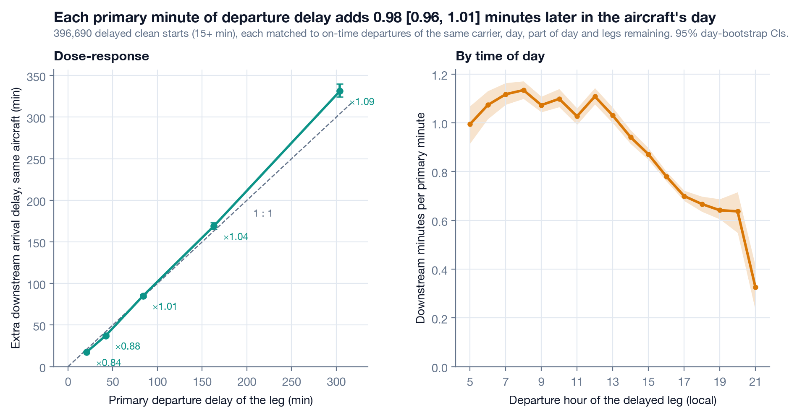
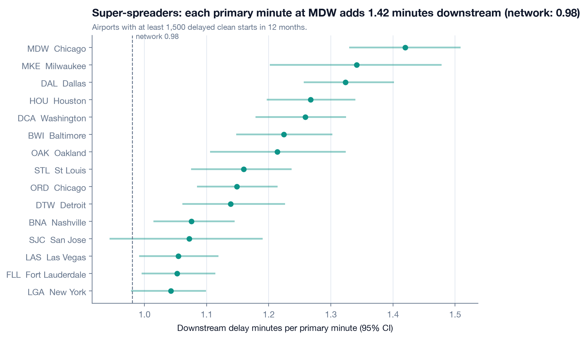
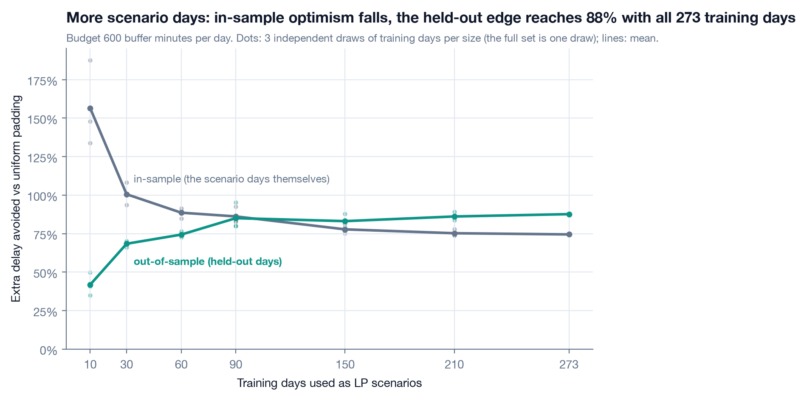

# delay-contagion

How a late flight infects the rest of the day through aircraft rotations, and where a limited budget of turnaround buffer stops the contagion best.

[](https://github.com/Pchambet/delay-contagion/actions/workflows/ci.yml)


[](https://pchambet.github.io/delay-contagion/)



## TL;DR

- **40% of US delay minutes are reactionary**: the aircraft arrived late from its previous leg. Across 7.04 million flights (Aug 2025 to Jul 2026), late-aircraft delay per departing flight grows from 1.2 minutes at 6:00 to 11.7 by 20:00.
- **A turn absorbs delay up to a sharp threshold, then passes it on one-for-one.** Southwest's effective minimum turn time is **τ = 48 min** [47, 48] with pass-through β = 0.98; across carriers τ spans 39 to 63 min. On held-out months this hinge model cuts the error on outbound delay to 11.67 min MAE, against 14.67 for a linear model that ignores slack and 22.50 for a constant (13 of 13 carriers improved).
- **Each primary minute of departure delay generates 0.98 [0.96, 1.00] more minutes of arrival delay later in the same aircraft's day** (396,690 delayed departures, each matched to on-time ones of the same carrier, day, part of day and remaining legs). Morning delays travel furthest, and the worst airport, MDW (Chicago), reaches 1.42.
- **Placement beats volume.** With 600 extra turn minutes a day across Southwest's network, buffers placed by a scenario LP avoid **1,048 [981, 1,116] minutes of arrival delay per day** on 92 held-out days: **1.8×** what uniform padding achieves (574), while padding the historically most-delayed turns does not beat uniform (516; paired difference -58 [-83, -33] min/day). Per buffer minute: 1.51 vs 0.91 (uniform) and 0.75 (greedy); the paired gain over uniform is 474 [437, 511] min/day.

## Why it matters

Most airline punctuality work forecasts the delay of one flight. Operations teams fight something else: one late aircraft drags its whole rotation, and schedule slack is the cheapest vaccine they control. Padding every turn is expensive (aircraft time is the scarcest resource an airline has); padding nothing makes the network fragile. The decision is *where* a few hundred minutes of slack buy the most punctuality, and that needs three things measured properly: how much delay is contagious, how a turn transmits it, and how a limited budget should be spread.

## Approach



1. **Data and clock.** The latest 12 published months of the BTS Reporting Carrier On-Time Performance files (Aug 2025 to Jul 2026) are discovered by probing the server, cached as Parquet and modelled in **dbt** on DuckDB. Times are local, so every leg is moved to UTC with its airport's IANA zone; the arrival date is resolved against the published block time, which handles red-eyes, the date line and DST nights (hand-made test cases).
2. **Rotations.** Legs of the same tail are chained when the aircraft physically continues: same station, scheduled ground time between 0 and 5 h, non-negative actual ground time (otherwise the tail was swapped). This yields 5.02 million turns.
3. **Propagation model.** `outbound = a + β · max(0, inbound − (slack − τ))`, fitted per carrier and per hub on the first 9 months, τ profiled on a 1-minute grid, CIs from a bootstrap over whole days, scored on the last 3 months; at the 15 busiest hubs τ spans 47 (ORD) to 57 (ATL) min (`results/hinge_airports.csv`).
4. **Contagion multiplier.** For *clean starts* (aircraft ready, flight still late) the downstream arrival delay of the same aircraft is compared with on-time clean starts of the same carrier, day, part of day and number of legs left.
5. **Decision.** A sample-average-approximation LP chooses extra minutes per (station, departure hour) for Southwest, subject to a daily budget, with the delay recursion along every aircraft chain as linear constraints. Scenarios are 90 training days; evaluation replays 92 held-out days.

## Results

**Reactionary delay builds through the day.** Late-arriving aircraft are a minor cause at dawn and match all primary causes combined by the evening.



**A turn is a hinge.** Held-out data (dots) follow the training-month fit (lines) closely: flat while the late inbound still leaves τ minutes on the ground, then a slope of one. In summer the plateau sits a few minutes higher than in the training fit.



| Carrier | τ (min, 95% CI) | β (95% CI) | Held-out MAE: constant / linear / hinge |
|---|---|---|---|
| Southwest | 48 [47, 48] | 0.98 [0.98, 0.99] | 21.4 / 12.4 / **10.2** |
| Delta | 60 [60, 61] | 1.04 [1.02, 1.05] | 20.1 / 14.3 / **11.5** |
| SkyWest | 41 [41, 42] | 1.02 [1.01, 1.02] | 21.6 / 13.8 / **10.1** |
| American | 57 [57, 57] | 1.01 [1.00, 1.01] | 26.1 / 18.0 / **13.4** |
| United | 63 [62, 63] | 1.02 [1.00, 1.03] | 22.3 / 17.0 / **13.9** |
| Republic | 41 [41, 42] | 1.01 [1.00, 1.02] | 22.3 / 13.9 / **11.0** |

**Contagion.** Excess downstream delay scales almost linearly with the primary delay (dashed: one-for-one), and delays that start in the morning travel furthest. By carrier the multiplier runs from 0.68 (United) to 1.91 (Allegiant); Southwest, whose aircraft fly the most legs a day on the shortest turns, sits at 1.24.



**Super-spreaders.** The airports where a primary minute costs the most downstream are short-turn, high-frequency stations, led by Southwest's point-to-point bases (interactive map in the [report](https://pchambet.github.io/delay-contagion/)).



## Reproduce

```bash
make setup     # uv sync --locked (Python 3.12)
make data      # download + cache 12 months of BTS files
make run       # dbt build + models + LP + result tables + figures
make report    # site/index.html
```

`make data` downloads about 350 MB of zip files (kept in `data/raw/`) and writes 80 MB of Parquet; the DuckDB warehouse needs 2 to 4 GB. `make run` took 4 to 6 minutes for dbt and 7 to 14 for the analysis on a busy 10-core laptop (the LP budget sweep and the scenario-size study dominate). DuckDB is capped at 3 GB and 3 threads. `make test lint` runs offline in about 30 s; CI also runs `dbt build` on a committed fixture of 2,540 real flights around the March 2026 DST switch.

## Repository layout

```
dbt/                 dbt project: staging -> intermediate -> marts, schema + singular tests
  fixtures/          2.5k-flight real fixture used by CI
  seeds/airports.csv IATA -> IANA time zone + coordinates
src/delay_contagion/
  ingest.py          discover, download and cache BTS months
  propagation.py     hinge model, sufficient statistics, day bootstrap, hold-out scores
  contagion.py       matched multiplier and super-spreader ranking
  buffer_lp.py       delay recursion, SAA LP (HiGHS), uniform and greedy policies
  analysis.py        chronological train/test pipeline -> results/
  figures.py, report.py, headlines.py
results/             small result tables behind every number in this README
docs/figures/        static figures
site/index.html      report page (GitHub Pages)
tests/               UTC/DST, chaining, hinge recovery, LP toy optimum, contagion recovery
```

## Methodology notes and limitations

- **What is out of sample.** Hinge parameters, LP buffers and the greedy ranking only see Aug 2025 to Apr 2026; every reported error or delay reduction is on May 2026 to Jul 2026. The held-out months are summer months with more delay than the average training day, which raises absolute minutes avoided for every policy alike.
- **The decision evaluation is model-based.** Buffers are scored by replaying held-out days through the fitted delay recursion: with zero buffer it reproduces every observed delay exactly, and the propagation component itself is validated out of sample (above). What a buffer does to *primary* delays (it does not change them here), to crew legality, gate use or the commercial value of a departure time is outside the model.
- **Scenario count matters, and the gap is measured.** Re-solving the LP on independent random draws of 10 to 90 training days, its in-sample edge over uniform padding falls from 157% to 86% while the held-out edge rises from 42% to 85%: with few days the LP chases their particular disruptions, with more it learns where turns are structurally too tight. At 90 days the two nearly coincide, a sign that the scenario set is large enough for this budget.



- **The contagion multiplier is observational.** Matching on carrier, day, part of day and remaining legs removes weather and exposure, not aircraft-level confounders. For slips under 15 minutes the estimated multiplier is higher than for real delays, a sign that small slips also flag tighter rotations; the headline uses 15+ minute delays.
- **Chains are conservative.** They break at cancellations, diversions, tail swaps and ground times over 5 hours, so delay that jumps aircraft (swaps, crew connections) is not counted; in that respect the multiplier understates network-wide contagion.
- **Cause codes are self-reported** by carriers and only exist for arrivals 15+ minutes late; the late-aircraft share ranges from 22% (SkyWest) to 52% (Frontier) across carriers, so cross-carrier comparisons of cause shares need care.
- **Coverage changes.** Hawaiian reports under Alaska from January 2026 (no held-out turns) and Spirit's reporting ends in May 2026 (207 held-out turns).

## References

- US DOT Bureau of Transportation Statistics, *Reporting Carrier On-Time Performance (1987-present)*, TranStats. Public domain. https://www.transtats.bts.gov/
- Beatty, R., Hsu, R., Berry, L., Rome, J. (1999). Preliminary evaluation of flight delay propagation through an airline schedule. *Air Traffic Control Quarterly* 7(4).
- AhmadBeygi, S., Cohn, A., Guan, Y., Belobaba, P. (2008). Analysis of the potential for delay propagation in passenger airline networks. *Journal of Air Transport Management* 14(5).
- Lan, S., Clarke, J.-P., Barnhart, C. (2006). Planning for robust airline operations: optimizing aircraft routings and flight departure times to minimize passenger disruptions. *Transportation Science* 40(1).
- Fleurquin, P., Ramasco, J. J., Eguiluz, V. M. (2013). Systemic delay propagation in the US airport network. *Scientific Reports* 3, 1159.
- Shapiro, A., Dentcheva, D., Ruszczynski, A. (2014). *Lectures on Stochastic Programming*, 2nd ed. SIAM (sample average approximation).
- Huangfu, Q., Hall, J. A. J. (2018). Parallelizing the dual revised simplex method. *Mathematical Programming Computation* 10 (HiGHS).
- `airportsdata` (airport IANA time zones), dbt-duckdb, DuckDB.

---

Built by [Pierre Chambet](https://github.com/Pchambet) — decision science for operations under uncertainty.
