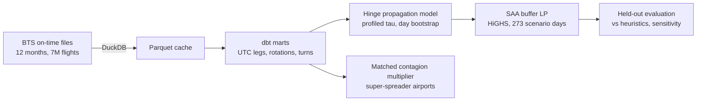
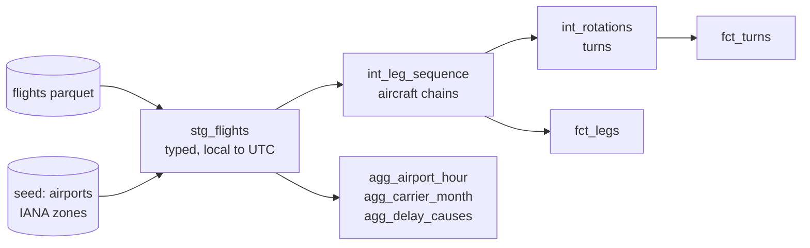

# delay-contagion

How a late flight infects the rest of the day through aircraft rotations, and where a limited budget of turnaround buffer absorbs the contagion best.

[](https://github.com/Pchambet/delay-contagion/actions/workflows/ci.yml)


[](https://pchambet.github.io/delay-contagion/)


<!-- Generated from src/delay_contagion/readme_template.md by `make report`; edit the template. -->

## TL;DR

- **40% of cause-coded US delay minutes are reactionary** (cause codes exist for arrivals 15+ min late): the aircraft arrived late from its previous leg. Late-aircraft delay per departing flight grows from 1.2 min at 6:00 to 11.7 by 20:00 (7.04 million flights, Aug 2025 to Jul 2026).
- **A turn absorbs delay up to a threshold, then passes it on about one-for-one.** Southwest's effective minimum turn time is **τ = 48 min**, with pass-through β = 0.98. On held-out months this two-parameter hinge reaches 11.67 min MAE against 14.65 for a linear model in inbound delay and slack; boosted trees do better (11.23), and the hinge is kept because it is interpretable and stays linear inside the decision model.
- **Each primary minute of departure delay adds 0.98 [0.96, 1.01] minutes of arrival delay later in the same aircraft's day**, from 396,690 delayed departures matched to on-time ones of the same carrier, day, part of day and legs left (0.95 when the origin airport is matched too).
- **Placement beats volume.** Placed by a scenario LP, a buffer minute avoids **1.52 min** of arrival delay on 92 held-out days, **1.7× as much as uniform padding** (0.91); padding the historically most-delayed turns does worse than uniform (0.62).
- **Padding buys predictability, not speed.** "Delay" here is arrival delay against the padded schedule (the DOT on-time definition). The LP's 1,093 min/day are 1.5% of held-out delay minutes, no aircraft lands earlier on the clock, and on the share of arrivals under 15 minutes late fractional uniform padding scores slightly higher (69.8% vs 69.6%), largely a threshold artefact (its 5-minute version: 69.4%).

## Why it matters

Most airline punctuality work forecasts the delay of one flight. Operations teams fight something else: one late aircraft drags its whole rotation, and schedule slack is the cheapest vaccine they control. Padding every turn is expensive (aircraft time is the scarcest resource an airline has); padding nothing makes the network fragile. The decision is *where* a few hundred minutes of slack buy the most punctuality, and that needs three things measured properly: how much delay is contagious, how a turn transmits it, and how a limited budget should be spread.

## Approach



The dbt layer (dbt-duckdb; 34 schema tests and 3 singular tests; `make dbt-fixture` builds it in CI on a committed fixture of 2,588 real flights around the March 2026 DST switch). The chart mirrors the dbt DAG; `make docs` generates the dbt docs site with the same lineage.



1. **Data and clock.** The latest 12 published months of the BTS Reporting Carrier On-Time Performance files (Aug 2025 to Jul 2026) are discovered by probing the server, cached as Parquet and modelled in **dbt** on DuckDB. Times are local, so every leg is moved to UTC with its airport's IANA zone (first occurrence inside the repeated fall-back hour); the arrival date is resolved against the published block time, which handles red-eyes, the date line and both DST nights (hand-made test cases).
2. **Rotations.** Legs of the same tail are chained when the aircraft physically continues: same station, scheduled ground time between 0 and 5 h, non-negative actual ground time (otherwise the tail was swapped). This yields 5.02 million turns.
3. **Propagation model.** `outbound = a + β · max(0, inbound − (slack − τ))`, fitted per carrier and per hub on the first 9 months, τ profiled on a 1-minute grid, CIs from a bootstrap over whole days, scored on the last 3 months against a constant, two linear models and boosted trees; at the 15 busiest hubs (chosen on training months) τ spans 47 (ORD) to 57 (ATL, SEA) min (`results/hinge_airports.csv`).
4. **Contagion multiplier.** For *clean starts* (aircraft ready, flight still late) the downstream arrival delay of the same aircraft is compared with on-time clean starts of the same carrier, day, part of day and number of legs left (4+ pooled), with stricter matching designs as robustness checks.
5. **Decision.** A sample-average-approximation LP chooses extra minutes per (station, departure hour) for Southwest, subject to a daily budget, with the delay recursion along every aircraft chain as linear constraints (1,811,979 constraints, 1,813,543 variables). Scenarios are all 273 training days; evaluation replays 92 held-out days. The objective and the headline metric are arrival delay against the padded schedule.

## Results

**Reactionary delay builds through the day.** Late-arriving aircraft are a minor cause at dawn and match all primary causes combined by the evening.


**A turn is a hinge, with a rounded knee.** Held-out data (dots) follow the training-month fit (lines): flat while the late inbound still leaves τ minutes on the ground, then a slope of about one. The knee is softer than the model's corner, and in summer Delta's plateau sits a few minutes above its fit. Slack only helps through the threshold: pinning τ at zero gives 16.80 MAE, and adding slack linearly barely moves the linear model (14.67 to 14.65). The boosted trees are better on 12 of 13 carriers with held-out data (Hawaiian, merged into Alaska, has none); the hinge keeps 87% of their gain over the slack-aware linear model with two interpretable parameters, which is what lets the decision model stay linear.


| Carrier | τ (min, 95% CI) | β (95% CI) | Held-out MAE: constant / linear / linear + slack / boosted trees / hinge |
|---|---|---|---|
| Southwest | 48 [47, 48] | 0.98 [0.98, 0.99] | 21.4 / 12.4 / 12.0 / 9.7 / **10.2** |
| Delta | 60 [60, 61] | 1.04 [1.02, 1.05] | 20.1 / 14.3 / 14.4 / 11.0 / **11.5** |
| SkyWest | 41 [41, 42] | 1.02 [1.01, 1.02] | 21.6 / 13.8 / 14.2 / 10.0 / **10.1** |
| American | 57 [57, 57] | 1.01 [1.00, 1.01] | 26.1 / 18.0 / 17.6 / 12.9 / **13.4** |
| United | 63 [62, 63] | 1.02 [1.00, 1.03] | 22.3 / 17.0 / 17.1 / 13.7 / **13.9** |
| Republic | 41 [41, 42] | 1.01 [1.00, 1.02] | 22.3 / 13.9 / 14.1 / 10.8 / **11.0** |

τ intervals come from a 1-minute grid, so an interval like [57, 57] means "within a minute", not certainty.

**Contagion.** Excess downstream delay scales almost linearly with the primary delay (dashed: one-for-one), and delays that start in the morning travel furthest. By carrier the multiplier runs from 0.68 (United) to 1.91 (Allegiant); Southwest, whose aircraft fly the most legs per aircraft-day (5.4; median scheduled turn 45 min, against 43 min for Envoy and PSA, the shortest), sits at 1.24 (`results/carrier_rotations.csv`).


The headline holds under stricter matching (`results/contagion_robustness.csv`). 19% of the "clean" starts still carry a late-aircraft cause code (28% of their minutes), so "primary" is an approximation; dropping them changes little. Matching within the origin airport mainly removes the excess of small slips, which cluster at congested airports.

| Matching design | Events (15+ min) | Multiplier (95% CI) | Slips of 1-14 min |
|---|---|---|---|
| Headline: carrier x day x part of day x legs left (4+) | 396,690 | 0.98 [0.96, 1.01] | 1.22 |
| + origin airport in the match | 159,615 | 0.95 [0.93, 0.97] | 1.02 |
| Exact legs left (no 4+ cap) | 381,386 | 0.98 [0.96, 1.01] | 1.17 |
| Without legs that carry a late-aircraft code | 320,338 | 0.99 [0.97, 1.02] | 1.19 |

**Super-spreaders.** Raw airport multipliers mostly track the carrier mix: MDW (Chicago) tops the raw ranking at 1.42, but its airlines alone predict 1.23, close to Southwest's network multiplier (1.24): the raw ranking is largely a carrier effect. Compared with each event's own carrier multiplier, the stations that add contagion of their own are congested hubs; the top three are MKE (Milwaukee), ORD (Chicago) and DCA (Washington) (+0.25 to +0.27 per primary minute above their carrier mix), and their 95% intervals overlap, so no single airport is singled out. Interactive map in the [report](https://pchambet.github.io/delay-contagion/).


**Where buffer pays.** The budget is set at 600 min/day on training-day traffic; busier summer days fly more turns, so on the 92 held-out days the LP schedules 718 min/day and uniform padding 643. Per buffer minute the comparison is at equal spend. 95% CIs from a bootstrap over whole weeks:

| Policy | Buffer used (min/day) | Delay avoided (min/day, 95% CI) | Per buffer minute | On time (A15) | Clock lateness (min/day) |
|---|---|---|---|---|---|
| No buffer | 0 | 0 | | 69.2% | 0 |
| LP-optimised | 718 | 1,093 [1,015, 1,169] | **1.52** | 69.6% | +751 |
| LP rounded to 5-min steps | 611 | 926 [863, 987] | **1.51** | 69.5% | +672 |
| Marginal-value greedy | 743 | 982 [899, 1,068] | **1.32** | 69.5% | +1,007 |
| Greedy: most-delayed turns | 758 | 473 [407, 542] | **0.62** | 69.4% | +489 |
| Uniform padding (fractional) | 643 | 582 [520, 644] | **0.91** | 69.8% | +750 |
| Uniform, 5 min on random cells | 659 | 538 [482, 594] | **0.82** | 69.4% | +838 |

Delay avoided is arrival delay against the padded schedule, summed per day; clock lateness is lateness against the original timetable (baseline 71,581 min/day). A buffer on one turn moves every later departure of that aircraft's day back in the timetable, so the same minutes count as avoided on each later leg that would have been late: that is why a buffer minute can avoid more than one minute of delay, and why on the clock every policy adds lateness. The LP's edge over uniform padding is 510 [482, 539] min/day, paired over days. The most-delayed-turns rule loses to uniform (-109 [-129, -89]), because those turns are late through their inbound, not through short slack. Fractional uniform padding is 12 seconds per turn; the implementable version, 5 minutes on randomly chosen station-hours, gets 0.82 per buffer minute. Fractional uniform padding's slight edge on the on-time share is mostly a threshold effect: a fraction of a minute on every turn nudges arrivals of exactly 15 minutes under the line, and the 5-minute version loses it (69.4%).

## Reproduce

```bash
make setup     # uv sync --locked (Python 3.12)
make data      # download + cache 12 months of BTS files
make run       # dbt build + models + LP + result tables + figures
make report    # site/index.html and this README, from results/
```

`make data` downloads about 350 MB of zip files (kept in `data/raw/`) and writes 80 MB of Parquet; the DuckDB warehouse needs about 4 GB. On a busy 10-core laptop `make run` took about 3 minutes for dbt and 26 for the analysis (the LP budget sweep over all training days and the scenario-size study dominate). DuckDB is capped at 3 GB and 3 threads, HiGHS and LightGBM at 3 threads. LightGBM is a runtime dependency only for the boosted-tree benchmark. `make test lint` (pytest, ruff, mypy) runs offline in under a minute; `make docs` builds the dbt docs on the fixture.

## Repository layout

```
dbt/                 dbt project: staging -> intermediate -> marts, schema + singular tests
  fixtures/          real-flight fixture used by CI
  seeds/airports.csv IATA -> IANA time zone + coordinates
src/delay_contagion/
  ingest.py          discover, download and cache BTS months
  propagation.py     hinge model, sufficient statistics, day bootstrap, baselines
  contagion.py       matched multiplier, robustness designs, carrier-adjusted ranking
  buffer_lp.py       delay recursion, SAA LP (HiGHS), heuristic policies
  analysis.py        chronological train/test pipeline -> results/
  figures.py, report.py, headlines.py, readme_template.md, report_template.html
results/             small result tables behind every number in this README
docs/figures/        static figures
site/index.html      report page (GitHub Pages)
tests/               UTC/DST, chaining, hinge recovery, LP toy optimum, contagion recovery
```

## Methodology notes and limitations

- **What is out of sample.** Hinge parameters, hub choice, LP buffers and heuristic rankings only see Aug 2025 to Apr 2026; every reported error or delay reduction is on May 2026 to Jul 2026. The held-out months are summer months with more traffic and delay than the average training day, which raises absolute minutes avoided for every policy alike.
- **The metric is schedule-relative, and the gain is small.** Delay avoided is arrival delay against the padded schedule. The LP's 1,093 min/day are 1.5% of the 71,581 held-out delay minutes per day. Against the original timetable every policy adds lateness (+751 min/day for the LP, +750 for uniform), and the on-time share (A15) moves from 69.2% to 69.6% (LP), 69.5% (LP in 5-minute steps), 69.5% (marginal greedy), 69.8% (fractional uniform) and 69.4% (uniform in 5-minute steps). The LP minimises delay minutes, so it targets long cascades rather than the 15-minute line. A budget-neutral variant that moves slack from loose turns to tight ones, keeping each timetable's length fixed (AhmadBeygi, Cohn and Lapp, 2010), would turn the reduction into clock time; it needs turn-level decisions and is not implemented here.
- **The decision evaluation is in-model.** Buffers are scored by replaying held-out days through the fitted recursion: with zero buffer it reproduces every observed delay exactly, but the LP optimised against the same hinge. Re-scoring the same buffers under other replay parameters moves the LP's absolute gain between 742 to 1,268 min/day, while its per-minute edge over uniform padding stays in the range 1.5× to 1.9×. The ranking is robust; absolute minutes depend on the model.

| Replay τ (min) | Replay β | LP avoided (min/day) | Uniform avoided (min/day) | LP / uniform per buffer minute |
|---|---|---|---|---|
| 48 | 0.98 | 1,093 | 582 | 1.68× |
| 38 | 0.98 | 865 | 414 | 1.87× |
| 43 | 0.98 | 981 | 494 | 1.78× |
| 53 | 0.98 | 1,190 | 678 | 1.57× |
| 58 | 0.98 | 1,268 | 771 | 1.47× |
| 48 | 0.80 | 742 | 399 | 1.67× |

- **β and τ are not clean causal effects.** Several carriers and hubs have β above 1 with intervals that exclude 1, which a turn cannot do physically: a common shock (weather or ATC at the station) delays both the inbound and the outbound's own departure. The same confounding can shift τ. The LP reads β as the causal effect of slack, so its absolute gains inherit this bias; the sensitivity table above bounds how much it matters for the ranking.
- **Buffers are continuous.** The LP is a relaxation: its buffers are fractional minutes. Rounded to 5-minute schedule steps, they avoid 1.51 min per buffer minute (611 min/day spent). Crew legality, gate use and the commercial value of a departure time are outside the model.
- **Scenario count.** Re-solving the LP on random draws of 10 to 273 training days, its in-sample edge over uniform padding falls from 157% to 74% while the held-out edge rises from 42% to 88% (85% at 90 days, 86% at 210): beyond about 90 days the held-out edge levels off. Read the gap with care: in-sample and held-out days are in different delay regimes (summer is busier), so the two curves meeting is not a test of SAA adequacy. No optimality-gap estimate (independent replications in the style of Mak, Morton and Wood) was run.


- **The contagion multiplier is observational.** Matching on carrier, day, part of day and legs left removes carrier-wide day-level conditions, not local weather or a ground stop at one airport, nor aircraft-level confounders; with the origin airport added to the match the multiplier is 0.95. The first bin of the dose-response (slips of 1 to 14 minutes, 1.22) is inflated by airport-level confounding: matched within the origin it drops from 1.22 to 1.02. The headline uses 15+ minute delays. Legs left is counted on the realised chain, after cancellations and swaps that the delay itself may cause, so it is partly a post-treatment quantity; matching on scheduled legs would need the cancelled legs kept in the chain.
- **Uncertainty is conditional on the models.** Policy CIs resample whole weeks of held-out days (14 blocks); hinge and contagion CIs resample days.
- **Chains are conservative.** They break at cancellations, diversions, tail swaps and ground times over 5 hours, so delay that jumps aircraft (swaps, crew connections) is not counted; in that respect the multiplier understates network-wide contagion.
- **Cause codes are self-reported** by carriers and only exist for arrivals 15+ minutes late; the late-aircraft share ranges from 22% (SkyWest) to 52% (Frontier) across carriers, so cross-carrier comparisons of cause shares need care.
- **Data window.** The fitting window drops turns with inbound delay outside −90 to 600 minutes or outbound outside −60 to 600 (0.1% of held-out turns). Hawaiian reports under Alaska from January 2026 (no held-out turns; 13 carriers are scored) and Spirit's reporting ends in May 2026 (207 held-out turns).

## References

- US DOT Bureau of Transportation Statistics, *Reporting Carrier On-Time Performance (1987-present)*, TranStats. Public domain. https://www.transtats.bts.gov/
- Beatty, R., Hsu, R., Berry, L., Rome, J. (1999). Preliminary evaluation of flight delay propagation through an airline schedule. *Air Traffic Control Quarterly* 7(4).
- AhmadBeygi, S., Cohn, A., Guan, Y., Belobaba, P. (2008). Analysis of the potential for delay propagation in passenger airline networks. *Journal of Air Transport Management* 14(5).
- AhmadBeygi, S., Cohn, A., Lapp, M. (2010). Decreasing airline delay propagation by re-allocating scheduled slack. *IIE Transactions* 42(7).
- Lan, S., Clarke, J.-P., Barnhart, C. (2006). Planning for robust airline operations: optimizing aircraft routings and flight departure times to minimize passenger disruptions. *Transportation Science* 40(1).
- Fleurquin, P., Ramasco, J. J., Eguiluz, V. M. (2013). Systemic delay propagation in the US airport network. *Scientific Reports* 3, 1159.
- Shapiro, A., Dentcheva, D., Ruszczynski, A. (2014). *Lectures on Stochastic Programming*, 2nd ed. SIAM (sample average approximation).
- Mak, W.-K., Morton, D. P., Wood, R. K. (1999). Monte Carlo bounding techniques for determining solution quality in stochastic programs. *Operations Research Letters* 24(1-2).
- Huangfu, Q., Hall, J. A. J. (2018). Parallelizing the dual revised simplex method. *Mathematical Programming Computation* 10 (HiGHS).
- Ke, G. et al. (2017). LightGBM: a highly efficient gradient boosting decision tree. *NeurIPS* 30.
- `airportsdata` (airport IANA time zones), dbt-duckdb, DuckDB.

---

Built by [Pierre Chambet](https://github.com/Pchambet) — decision science for operations under uncertainty.
